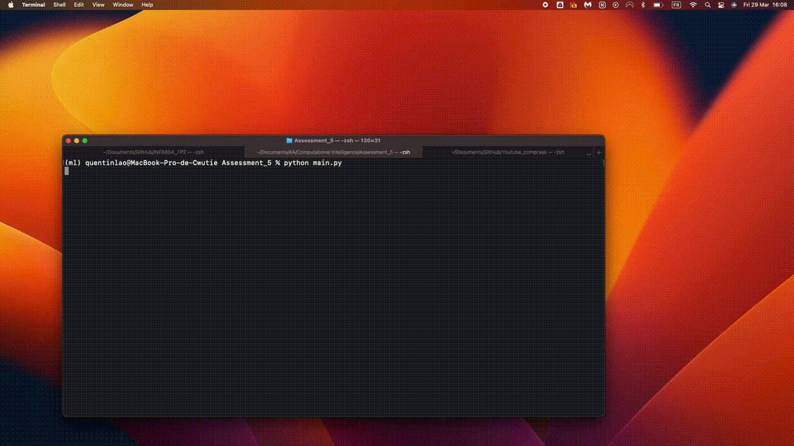

# First example

Parameters used :
```
{ "width" : 1200,
"height" : 800, 
"capture_width" : 100,
"capture_height" : 100,
"show_capture" : true,
"mass" : 2,
"speed_max" : 5, 
"horizontal_distance" : 60,
"vertical_distance" : 60,
"security_zone" : 20,
"wave_frequency" : 1,
"wave_speed" : 60,
"show_waves" : false,
"wind_speed" : 0,
"wind_angle" : 45
}
```


# Second example (with wind)

Parameters used :
```
{ "width" : 1200,
"height" : 800, 
"capture_width" : 100,
"capture_height" : 100,
"show_capture" : true,
"mass" : 2,
"speed_max" : 5, 
"horizontal_distance" : 60,
"vertical_distance" : 60,
"security_zone" : 20,
"wave_frequency" : 1,
"wave_speed" : 60,
"show_waves" : false,
"wind_speed" : 0,
"wind_angle" : 45
}
```


# Thirs example (High communication wave periodicity and show them)

Parameters used :
```
{ "width" : 1200,
"height" : 800, 
"capture_width" : 100,
"capture_height" : 100,
"show_capture" : true,
"mass" : 2,
"speed_max" : 5, 
"horizontal_distance" : 60,
"vertical_distance" : 60,
"security_zone" : 20,
"wave_frequency" : 10,
"wave_speed" : 10,
"show_waves" : true,
"wind_speed" : 0,
"wind_angle" : 45
}
```


# Second example
